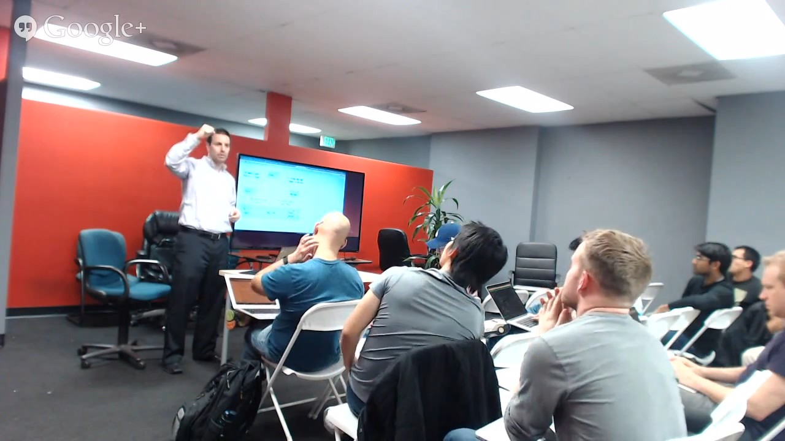

# Angular is Dead

Presentation at the [Los Angeles AngularJS Meetup](http://www.meetup.com/socal-angular/events/213154962)

Click on the image above to watch the video of the talk (bad audio quality. sorry!)

## View slides

    npm start

## Setup my laptop

Modify .Xresources

    comment out: *background:            S_base03
    replace xterm*faceSize: 11 with xterm*faceSize: 30
    xrdb ~/.Xresources

Run node.js container

    docker run --rm -it -p 3000:3000 -v $(pwd):/home/developer oreng/node /bin/bash
